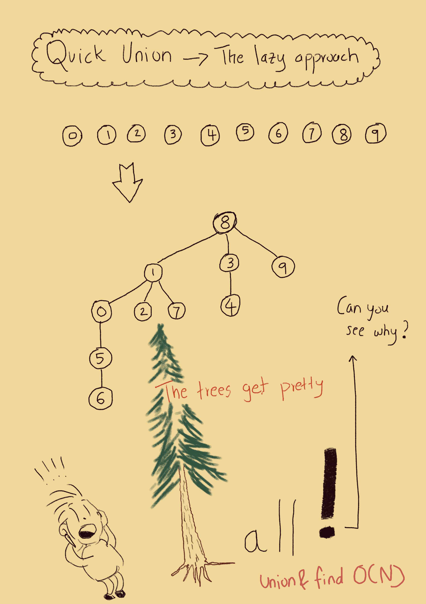
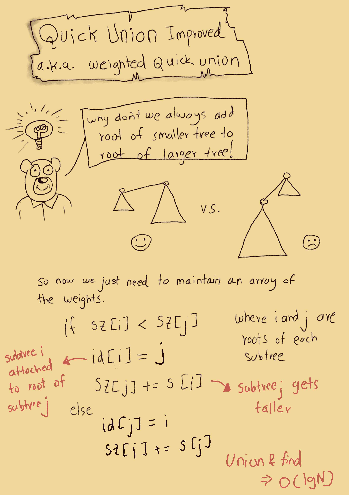

# Algorithms 1
Notes and code related to Algorithms 4th edition by Sedgewick and Wayne

## Week 1
### Union Find



### Analysis of algorithms
**Be careful**
Three loops does not necessarily mean cubic time.
The runtime for the following is `~N^2*lgN`

```py
for i in range(len(arr)):
  for j in range(i+1, len(arr)):
    k = j + 1
    while k < len(arr):
      ## do something
      k *= 2
```


### binary search
Java had a [bug](https://ai.googleblog.com/2006/06/extra-extra-read-all-about-it-nearly.html) in its implementation as late as 2006!


# Resources
* [Course site](https://algs4.cs.princeton.edu)
* [Examples in Python](https://github.com/shellfly/algs4-py)
* [Algorithms1 on Coursera](https://www.coursera.org/learn/algorithms-part1/home/welcome)
* [Cheatsheets](https://algs4.cs.princeton.edu/cheatsheet/)
